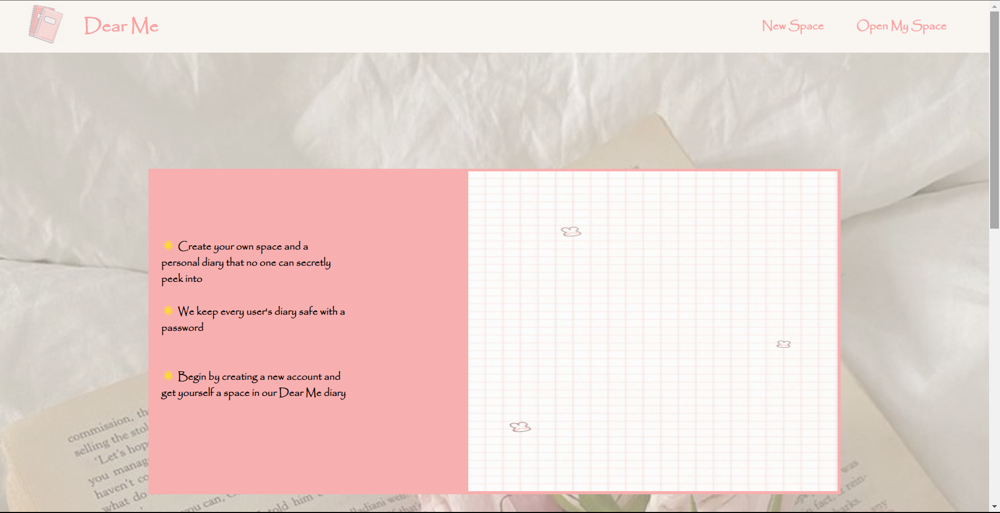
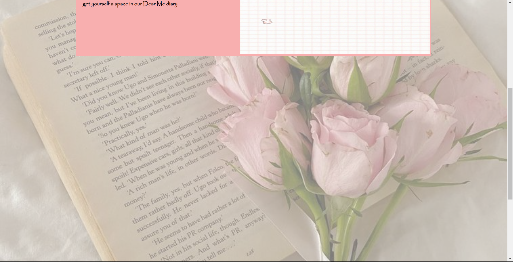

# project02

The Online Personal Diary (Dear Me) is a web-based application that allows users to create their own private journals and write their daily thoughts securely without sharing them with anyone else. This application provides a simple and intuitive interface for users to keep their personal writings organized and easily accessible.

